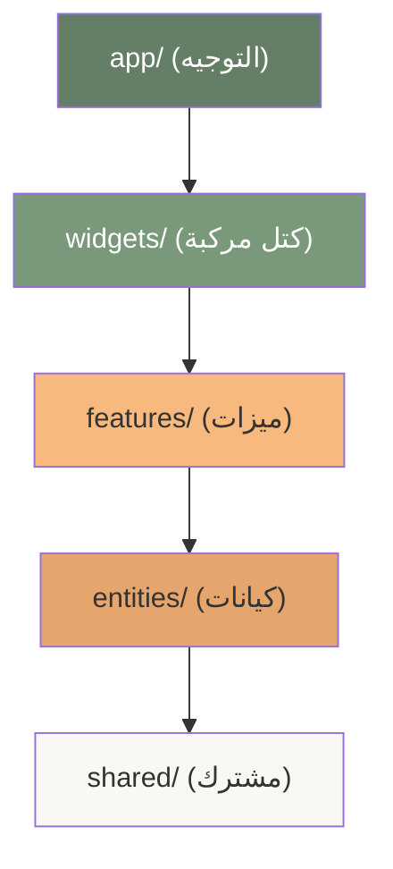
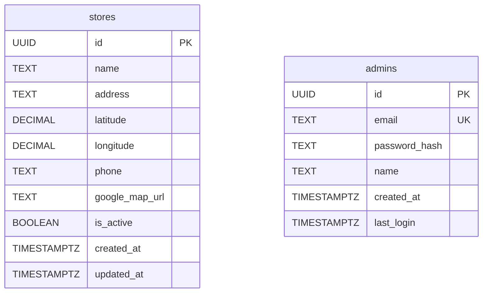
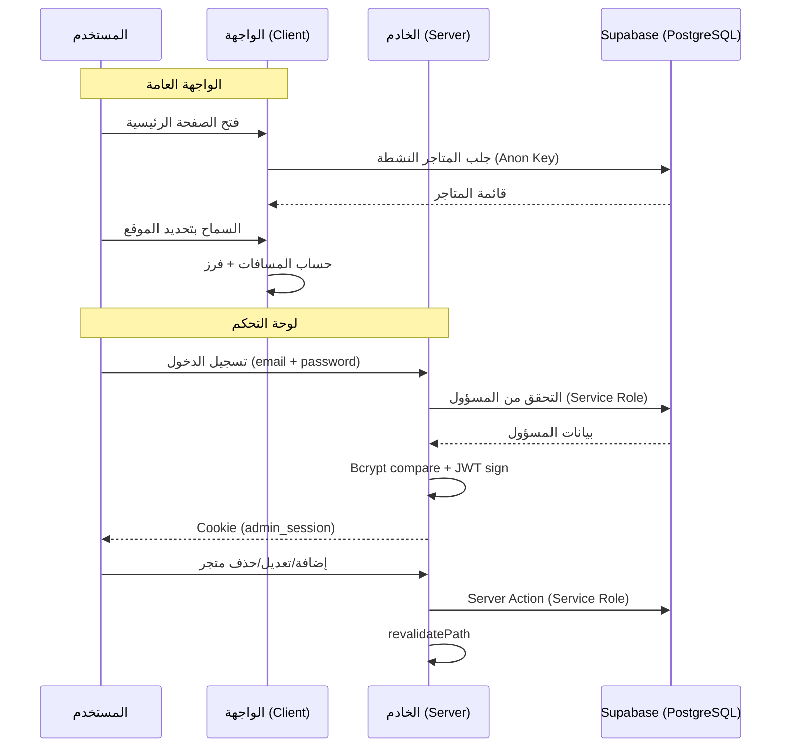

# 📋 وثيقة مشروع Fastika Store Locator - توثيق شامل

> تطبيق ويب لعرض نقاط بيع منتجات شوكولاتة فستكا مع ميزة تحديد الموقع الجغرافي لترتيب المتاجر حسب الأقرب.

---

## 1. شجرة هيكل المشروع الكاملة (Project Tree)

```
store-locator/
├── 📄 .env.local                          # متغيرات البيئة (Supabase + JWT)
├── 📄 .gitignore                          # ملفات مستثناة من Git
├── 📄 README.md                           # توثيق المشروع الأساسي
├── 📄 components.json                     # إعدادات shadcn/ui
├── 📄 eslint.config.mjs                   # إعدادات ESLint
├── 📄 next-env.d.ts                       # أنواع TypeScript لـ Next.js
├── 📄 next.config.ts                      # إعدادات Next.js (React Compiler مفعل)
├── 📄 package.json                        # الاعتمادات والسكربتات
├── 📄 package-lock.json                   # قفل إصدارات الحزم
├── 📄 playwright.config.ts                # إعدادات اختبارات E2E
├── 📄 postcss.config.mjs                  # إعدادات PostCSS (Tailwind)
├── 📄 tsconfig.json                       # إعدادات TypeScript
├── 📄 vitest.config.ts                    # إعدادات اختبارات الوحدات
│
├── 📁 e2e/                                # اختبارات E2E (فارغ حالياً)
│
├── 📁 public/                             # ملفات ثابتة
│   ├── 🖼️ Asset 1.png
│   ├── 🖼️ logo.jpg                       # شعار فستكا
│   ├── 🖼️ file.svg / globe.svg / next.svg / vercel.svg / window.svg
│
├── 📁 supabase/
│   └── 📁 migrations/
│       └── 📄 001_initial_schema.sql      # مخطط قاعدة البيانات الأولي
│
└── 📁 src/                                # الكود المصدري
    ├── 📄 middleware.ts                    # حماية مسارات Admin (JWT)
    │
    ├── 📁 app/                            # طبقة التطبيق (Next.js App Router)
    │   ├── 📄 layout.tsx                  # Root Layout (RTL + ThemeProvider)
    │   ├── 📄 providers.tsx               # ThemeProvider (next-themes)
    │   ├── 📄 globals.css                 # أنماط عامة + ألوان العلامة التجارية
    │   ├── 🖼️ favicon.ico
    │   │
    │   ├── 📁 (frontend)/                 # مجموعة مسارات الواجهة العامة
    │   │   ├── 📄 layout.tsx              # Header + Footer wrapper + SEO
    │   │   └── 📄 page.tsx                # الصفحة الرئيسية → StoresList
    │   │
    │   └── 📁 (admin)/                    # مجموعة مسارات لوحة التحكم
    │       ├── 📄 layout.tsx              # Admin wrapper (RTL + bg)
    │       ├── 📁 login/
    │       │   └── 📄 page.tsx            # صفحة تسجيل الدخول → LoginForm
    │       ├── 📁 dashboard/
    │       │   └── 📄 page.tsx            # لوحة التحكم (إحصائيات + إجراءات)
    │       └── 📁 stores/
    │           ├── 📄 page.tsx            # قائمة المتاجر (جدول + إحصائيات)
    │           ├── 📁 add/
    │           │   └── 📄 page.tsx        # إضافة متجر → StoreForm(create)
    │           └── 📁 [id]/
    │               └── 📁 edit/
    │                   └── 📄 page.tsx    # تعديل متجر → StoreForm(edit)
    │
    ├── 📁 entities/                       # كيانات الأعمال (FSD)
    │   ├── 📁 admin/
    │   │   └── 📁 model/
    │   │       ├── 📄 index.ts            # barrel export
    │   │       └── 📄 types.ts            # Admin, AdminSession, AdminJWTPayload
    │   │
    │   └── 📁 store/
    │       ├── 📁 model/
    │       │   ├── 📄 index.ts            # barrel export
    │       │   └── 📄 types.ts            # Store, StoreWithDistance, StoreFormData
    │       ├── 📁 api/
    │       │   ├── 📄 index.ts            # barrel export
    │       │   ├── 📄 queries.ts          # getActiveStores, getAllStores, getStoreById, getStoresCount
    │       │   └── 📄 mutations.ts        # createStore, updateStore, deleteStore, toggleStoreStatus
    │       └── 📁 ui/
    │           ├── 📄 index.ts            # barrel export
    │           ├── 📄 StoreForm.tsx        # نموذج إضافة/تعديل متجر (Zod + RHF)
    │           └── 📄 StoreTable.tsx       # جدول المتاجر + حذف + تفعيل/تعطيل
    │
    ├── 📁 features/                       # الميزات الوظيفية (FSD)
    │   ├── 📁 admin-auth/
    │   │   ├── 📁 lib/
    │   │   │   ├── 📄 index.ts            # barrel export
    │   │   │   └── 📄 auth.ts             # loginAdmin, logoutAdmin, getAdminSession, hashPassword
    │   │   └── 📁 ui/
    │   │       ├── 📄 index.ts            # barrel export
    │   │       └── 📄 LoginForm.tsx        # نموذج تسجيل الدخول (Motion animations)
    │   │
    │   └── 📁 store-locator/
    │       ├── 📁 lib/
    │       │   ├── 📄 index.ts            # barrel export
    │       │   ├── 📄 geolocation-index.ts # re-export distance
    │       │   ├── 📄 distance.ts          # calculateDistanceKm, sortStoresByDistance, formatDistance
    │       │   ├── 📄 useStores.ts         # هوك جلب المتاجر من Supabase + فرز بالمسافة
    │       │   └── 📄 useUserLocation.ts   # هوك تحديد موقع المستخدم (Geolocation API)
    │       └── 📁 ui/
    │           ├── 📄 index.ts            # barrel export
    │           ├── 📄 StoreCard.tsx        # بطاقة متجر (مسافة + زر خريطة + Motion)
    │           ├── 📄 StoresList.tsx       # قائمة المتاجر الكاملة (Grid + States)
    │           └── 📄 LocationPermission.tsx # طلب إذن الموقع من المستخدم
    │
    ├── 📁 shared/                         # الكود المشترك (FSD)
    │   ├── 📁 api/
    │   │   └── 📁 supabase/
    │   │       ├── 📄 index.ts            # barrel export
    │   │       ├── 📄 client.ts           # Supabase Browser Client (Singleton)
    │   │       └── 📄 server.ts           # Supabase Server Client + Admin Client
    │   ├── 📁 config/                     # (فارغ حالياً)
    │   ├── 📁 lib/
    │   │   ├── 📄 utils.ts               # cn() - دالة دمج أصناف Tailwind
    │   │   └── 📄 test-setup.ts           # إعداد Vitest (mocks لـ Next.js)
    │   ├── 📁 types/
    │   │   └── 📄 database.ts            # أنواع قاعدة البيانات (Database, StoreRow, AdminRow)
    │   └── 📁 ui/                         # مكونات shadcn/ui
    │       ├── 📄 badge.tsx
    │       ├── 📄 button.tsx
    │       ├── 📄 card.tsx
    │       ├── 📄 checkbox.tsx
    │       ├── 📄 dialog.tsx
    │       ├── 📄 input.tsx
    │       ├── 📄 label.tsx
    │       ├── 📄 select.tsx
    │       ├── 📄 separator.tsx
    │       ├── 📄 skeleton.tsx
    │       ├── 📄 sonner.tsx
    │       └── 📄 table.tsx
    │
    └── 📁 widgets/                        # كتل واجهة المستخدم المركبة (FSD)
        ├── 📁 header/
        │   └── 📁 ui/
        │       ├── 📄 index.ts
        │       └── 📄 Header.tsx          # شريط علوي (شعار + اسم + شعار فستكا)
        ├── 📁 footer/
        │   └── 📁 ui/
        │       ├── 📄 index.ts
        │       └── 📄 Footer.tsx          # تذييل (شعار + حقوق النشر)
        └── 📁 admin-layout/
            └── 📁 ui/
                ├── 📄 index.ts
                ├── 📄 AdminLayout.tsx     # هيكل لوحة التحكم (Sidebar + Main)
                ├── 📄 AdminHeader.tsx     # عنوان الصفحة + ترحيب + تاريخ
                └── 📄 AdminNav.tsx        # شريط جانبي متجاوب (Desktop + Mobile)
```

---

## 2. التقنيات والإصدارات

| التقنية | الإصدار | الغرض |
|---------|---------|-------|
| Next.js | 16.1.6 | إطار العمل الرئيسي (App Router) |
| React | 19.2.3 | مكتبة واجهة المستخدم |
| TypeScript | ^5 | سلامة الأنواع |
| Tailwind CSS | v4 | التصميم |
| Supabase (SSR) | ^0.8.0 | قاعدة بيانات + مصادقة |
| React Hook Form | ^7.71.1 | إدارة النماذج |
| Zod | ^4.3.6 | التحقق من المدخلات |
| Jose | ^6.1.3 | JWT (إنشاء/تحقق) |
| Bcryptjs | ^3.0.3 | تشفير كلمات المرور |
| Geolib | ^3.3.4 | حسابات المسافة |
| Motion (Framer) | ^12.34.0 | حركات بصرية |
| Radix UI | ^1.4.3 | مكونات واجهة أساسية |
| Lucide React | ^0.563.0 | أيقونات |
| shadcn/ui | (new-york) | نظام تصميم مكونات |
| Vitest | ^3.2.4 | اختبارات وحدات |
| Playwright | ^1.58.2 | اختبارات E2E |

---

## 3. المعمارية (Feature-Sliced Design)

يتبع المشروع معمارية **FSD** المعدلة لـ Next.js:



| الطبقة | الغرض | أمثلة |
|--------|-------|-------|
| `app/` | صفحات التوجيه فقط، بدون منطق | `page.tsx`, `layout.tsx` |
| `widgets/` | كتل واجهة مركبة قابلة لإعادة الاستخدام | `Header`, `Footer`, `AdminLayout` |
| `features/` | ميزات وظيفية مستقلة | `admin-auth`, `store-locator` |
| `entities/` | كيانات الأعمال ونماذج البيانات | `store`, `admin` |
| `shared/` | كود مشترك، أدوات، مكونات أساسية | `supabase client`, `ui components` |

---

## 4. تحليل الملفات التفصيلي

### 4.1 ملفات الإعدادات (Root Config)

| الملف | الوصف |
|-------|-------|
| `next.config.ts` | React Compiler مفعل، بدون إعدادات إضافية |
| `tsconfig.json` | Target ES2017، مسارات `@/*` → `./src/*`، strict mode |
| `components.json` | shadcn/ui بنمط new-york، baseColor: stone، مع Lucide |
| `vitest.config.ts` | بيئة jsdom، تغطية v8، ملف إعداد للاختبارات |
| `playwright.config.ts` | 5 متصفحات (Chrome, Firefox, Safari, Mobile Chrome/Safari) |
| `postcss.config.mjs` | `@tailwindcss/postcss` فقط |
| `eslint.config.mjs` | إعدادات Next.js core-web-vitals + TypeScript |

---

### 4.2 طبقة التطبيق (`src/app/`)

#### `layout.tsx` — Root Layout
- يعيّن `lang="ar"` و `dir="rtl"` على عنصر `<html>`
- يغلف التطبيق بـ `ThemeProvider` (next-themes)
- يحدد عنوان ووصف SEO بالعربية

#### `providers.tsx`
- Client Component يغلف `NextThemesProvider`
- السمة الافتراضية: `light`، النظام معطل

#### `globals.css` — نظام التصميم
- يستورد Tailwind CSS v4 بالصيغة الجديدة `@import "tailwindcss"`
- يعرّف ألوان العلامة التجارية:
  - أخضر (`#657f66`) — اللون الأساسي
  - برتقالي (`#f8b97e`) — لون التمييز
  - كريمي (`#faf8f5`) — خلفية
- يعرّف متغيرات shadcn/ui (HSL) مع أصناف مساعدة (`.bg-brand`, `.text-brand`)
- شريط تمرير مخصص بألوان العلامة

#### مجموعة `(frontend)/`
- **`layout.tsx`**: يغلف المحتوى بـ `Header` + `Footer`، مع Open Graph metadata
- **`page.tsx`**: يعرض `StoresList` فقط (5 أسطر)

#### مجموعة `(admin)/`
- **`layout.tsx`**: خلفية رمادية + RTL
- **`login/page.tsx`**: يعرض `LoginForm`
- **`dashboard/page.tsx`**: Server Component — يجلب الجلسة + إحصائيات المتاجر + إجراءات سريعة (3 روابط)
- **`stores/page.tsx`**: Server Component — قائمة المتاجر مع `StoreTable`
- **`stores/add/page.tsx`**: `StoreForm` بوضع `create`
- **`stores/[id]/edit/page.tsx`**: يجلب بيانات المتجر ويعرض `StoreForm` بوضع `edit`

---

### 4.3 طبقة الكيانات (`src/entities/`)

#### كيان المتجر (`store/`)

**`model/types.ts`** — 4 واجهات:
- `Store` — الكيان الأساسي (10 حقول)
- `StoreWithDistance` — يمتد من Store مع حقل `distance?`
- `StoreFormData` — بيانات النموذج
- `StoreCreateInput` / `StoreUpdateInput` — مدخلات API

**`api/queries.ts`** — دوال القراءة (Server):
- `getActiveStores()` — المتاجر النشطة فقط
- `getAllStores()` — جميع المتاجر (للمسؤول)
- `getStoreById(id)` — متجر واحد
- `getStoresCount()` — عدد الإجمالي والنشط
- `sortStoresByDistance()` — فرز بالمسافة (Haversine)

**`api/mutations.ts`** — Server Actions:
- `createStore(input)` — إنشاء + `revalidatePath`
- `updateStore(input)` — تحديث جزئي
- `deleteStore(id)` — حذف
- `toggleStoreStatus(id, isActive)` — تفعيل/تعطيل

**`ui/StoreForm.tsx`** — نموذج ذكي (292 سطر):
- Zod schema للتحقق من صحة المدخلات
- ميزة استخراج الإحداثيات تلقائياً من رابط Google Maps
- وضعان: `create` و `edit`

**`ui/StoreTable.tsx`** — جدول تفاعلي (195 سطر):
- تفعيل/تعطيل المتجر
- حذف مع مربع حوار تأكيد (`Dialog`)
- حالة فارغة جميلة

#### كيان المسؤول (`admin/`)

**`model/types.ts`** — 4 واجهات:
- `Admin` — بدون `password_hash`
- `AdminLoginCredentials`
- `AdminSession` — يحتوي على `admin` + `token` + `expiresAt`
- `AdminJWTPayload`

---

### 4.4 طبقة الميزات (`src/features/`)

#### ميزة مصادقة المسؤول (`admin-auth/`)

**`lib/auth.ts`** — Server Actions (137 سطر):
- `loginAdmin(email, password)` — تحقق bcrypt → إنشاء JWT (7 أيام) → كوكي httpOnly
- `logoutAdmin()` — حذف الكوكي
- `getAdminSession()` — التحقق من JWT + جلب بيانات المسؤول
- `isAuthenticated()` — فحص سريع
- `hashPassword(password)` — تشفير bcrypt

**`ui/LoginForm.tsx`** — واجهة تسجيل الدخول:
- Motion animations عند المونت
- شعار + حقلي بريد/كلمة مرور
- عرض بيانات الدخول الافتراضية
- بعد النجاح: `window.location.href` للتنقل الكامل

#### ميزة محدد المتاجر (`store-locator/`)

**`lib/distance.ts`** — حسابات المسافة:
- `calculateDistanceKm()` — باستخدام مكتبة `geolib`
- `sortStoresByDistance()` — فرز المتاجر
- `formatDistance()` — تنسيق المسافة (متر/كم)
- `getNearbyStores()` — فلترة حسب النطاق (افتراضي 10 كم)

**`lib/useUserLocation.ts`** — هوك الموقع (151 سطر):
- يتحقق من توفر Geolocation API
- يدير حالة الإذن (prompt/granted/denied/unavailable)
- يستمع لتغييرات الإذن ديناميكياً
- رسائل خطأ بالعربية لكل حالة
- إعدادات: دقة عالية، مهلة 10 ثوانٍ، تخزين مؤقت 5 دقائق

**`lib/useStores.ts`** — هوك المتاجر:
- يجلب المتاجر النشطة من Supabase (Client-side)
- يفرز حسب المسافة عند توفر موقع المستخدم (`useMemo`)
- يوفر دالة `refetch()`

**`ui/StoreCard.tsx`** — بطاقة المتجر:
- Motion animations (ظهور متتابع + hover)
- أيقونة متجر + اسم + شارة مسافة
- عنوان مع أيقونة دبوس
- زر "افتح في الخريطة" (Google Maps)

**`ui/StoresList.tsx`** — القائمة الرئيسية (177 سطر):
- يدمج `useUserLocation` + `useStores`
- 5 حالات عرض: طلب إذن → نجاح الموقع → تحميل (Skeleton) → خطأ → فارغ → القائمة
- Grid متجاوب (1/2/3 أعمدة)

**`ui/LocationPermission.tsx`** — مكون طلب الإذن:
- 3 حالات مختلفة (prompt/denied/unavailable)
- تصميم مميز بألوان العلامة التجارية

---

### 4.5 طبقة المشترك (`src/shared/`)

**`api/supabase/client.ts`** — عميل المتصفح:
- Singleton pattern لـ `createBrowserClient`
- يستخدم `NEXT_PUBLIC_SUPABASE_URL` و `NEXT_PUBLIC_SUPABASE_ANON_KEY`

**`api/supabase/server.ts`** — عميل الخادم:
- `createClient()` — للقراءة العامة (Anon Key)
- `createAdminClient()` — للعمليات الإدارية (Service Role Key)
- كلاهما يدير cookies لـ SSR

**`types/database.ts`** — أنواع Supabase:
- `Database` interface كامل (stores + admins)
- أنواع مساعدة: `StoreRow`, `StoreInsert`, `StoreUpdate`, `AdminRow`, etc.

**`lib/utils.ts`** — `cn()` لدمج أصناف Tailwind (clsx + tailwind-merge)

**`lib/test-setup.ts`** — إعداد Vitest:
- Mock لـ `next/navigation` (router, pathname, searchParams)
- Mock لـ `next/headers` (cookies)
- Cleanup تلقائي بعد كل اختبار

**`ui/`** — 12 مكون shadcn/ui: badge, button, card, checkbox, dialog, input, label, select, separator, skeleton, sonner, table

---

### 4.6 طبقة الودجات (`src/widgets/`)

**`Header.tsx`** — الشريط العلوي:
- شعار مستدير مع `Image` (priority loading)
- عنوان "فستكا" + "Fastika" بالبرتقالي
- شعار "صُنعت بحبّ لتجمع بين الفخامة والنكهة الفريدة"
- Motion animations عند الظهور

**`Footer.tsx`** — التذييل:
- شعار مصغر + اسم العلامة
- "شوكولاتة دبي الفاخرة"
- حقوق النشر ديناميكية بالسنة الحالية
- Motion animate عند الظهور في viewport

**`AdminLayout.tsx`** — هيكل لوحة التحكم:
- `AdminNav` (شريط جانبي) + `AdminHeader` + محتوى

**`AdminHeader.tsx`**:
- عنوان الصفحة + رسالة ترحيب
- التاريخ الحالي بالتقويم العربي اليمني

**`AdminNav.tsx`** — تنقل متجاوب (156 سطر):
- Desktop: شريط جانبي ثابت (264px) على اليمين
- Mobile: قائمة كاملة الشاشة مع Motion (slide + fade)
- روابط: لوحة التحكم، نقاط البيع، إضافة نقطة
- زر تسجيل خروج + رابط لعرض الموقع
- مؤشر الصفحة النشطة (لون برتقالي)

---

### 4.7 حماية المسارات (`middleware.ts`)

**`middleware.ts`** — حماية JWT:
- يحمي جميع مسارات `/admin/*` ما عدا `/admin/login`
- يتحقق من كوكي `admin_session` ← JWT verify بـ `jose`
- إذا لا يوجد token أو غير صالح → إعادة توجيه لصفحة الدخول
- `/admin` مباشرة → إعادة توجيه لـ `/admin/dashboard` أو `/admin/login`

---

### 4.8 قاعدة البيانات

**`001_initial_schema.sql`** — المخطط الأولي:



- **Extensions**: uuid-ossp, pgcrypto
- **Indexes**: stores(latitude, longitude), stores(is_active), admins(email)
- **Trigger**: `update_updated_at` — تحديث تلقائي لـ `updated_at`
- **RLS**: مفعل على الجدولين
  - stores: القراءة للمتاجر النشطة للجميع، الكتابة لـ service_role فقط
  - admins: الوصول لـ service_role فقط
- **بيانات أولية**: مسؤول افتراضي + 26 متجراً في مدينة إب

---

## 5. متغيرات البيئة

| المتغير | الغرض |
|---------|-------|
| `NEXT_PUBLIC_SUPABASE_URL` | رابط مشروع Supabase |
| `NEXT_PUBLIC_SUPABASE_ANON_KEY` | مفتاح Anon (عام، قراءة فقط) |
| `SUPABASE_SERVICE_ROLE_KEY` | مفتاح Service Role (خادم، صلاحيات كاملة) |
| `ADMIN_JWT_SECRET` | مفتاح تشفير JWT للمسؤولين |

> ⚠️ **تحذير:** ملف `.env.local` يحتوي على مفاتيح حقيقية. تأكد من عدم مشاركته أو رفعه لـ Git.

---

## 6. الأوامر المتاحة

| الأمر | الوصف |
|-------|-------|
| `npm run dev` | تشغيل خادم التطوير |
| `npm run build` | بناء الإنتاج |
| `npm run start` | تشغيل الإنتاج |
| `npm run lint` | فحص ESLint |
| `npm run test` | اختبارات Vitest |
| `npm run test:ui` | اختبارات Vitest مع واجهة |
| `npm run test:e2e` | اختبارات Playwright |
| `npm run test:e2e:ui` | اختبارات Playwright مع واجهة |

---

## 7. تدفق البيانات (Data Flow)



---

**تم إعداد هذا التوثيق بناءً على فحص عميق لكل ملف في المشروع (81 ملف).**
